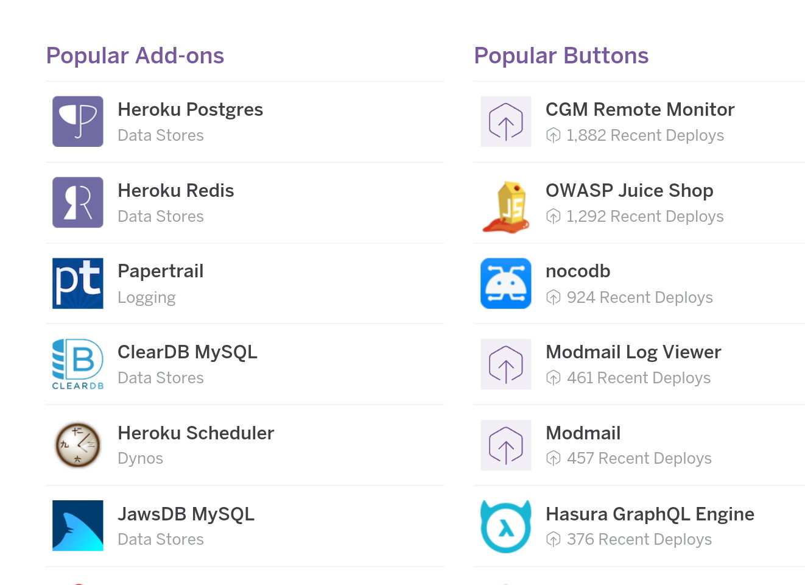
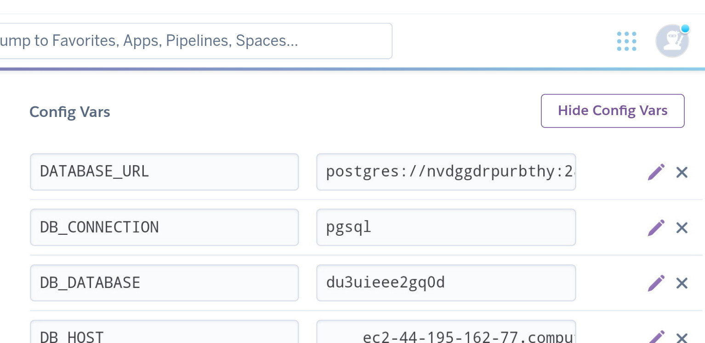

# Heroku Laravel

## _Deploy Your Laravel With Heroku_ 🙌🏻

### Tentang Heroku 🤔 
[Heroku](https://heroku.com)  adalah sebuah Platform As Service yang memungkinkan untuk melakukan build and run application di lingkungan cloud.

### 1. Persiapan Lingkungan Pengembang
Pastikan telah memiliki akun heroku aktif, jika belum memiliki akun bisa daftar melalui tautan [berikut](http://heroku.com/login).

#### 1. 1 Install Node JS
Node js digunakan untuk melakukan instalasi package heroku melalui command line. Pengguna linux bisa menggunakan perintah
```bash
$ sudo apt install nodejs-lts
```
Khusus pengguna Windows dapat menggunakan file installer Node JS melalui tautan [berikut](https://nodejs.org/en/download/)

Instalasi git pada komputer akan secara otomatis menambahkan *NPM / Node Package Manager* pada komputer.

#### 1.2 Instalasi Git
Git adalah sebuah version control system yang populer dan gratis yang digunakan untuk melakukan remote pada repository project pada platform heroku. Untuk pengguna linux dapat menggunakan perintah
```bash
$ sudo apt install git
```

Khusus penggunan Windows dapat menggunakan file installer pada tautan [berikut](https://git-scm.com/downloads)

Setelah terinstall pada komputer, lakukan konfigurasi awal pada git melalui beberapa perintah berikut :
```bash
$ git config --global user.email "your@email"
$ git config --global user.name "your name"
```

Instalasi git pada komputer akan secara otomatis menambahkan *Git Bash* pada komputer.

#### 1.3 Instalasi Heroku CLI
Heroku memiliki tool berbasis CLI yang dapat digunakan dalam melakukan tahap deployment apkikasi ke dalam layanan Heroku dengan cepat dan mudah. Instalasi dapat digunakan melalui *NPM* dan *git bash* yang telah terinstall pada komputer.

Gunakan terminal cmd/ powershel/ git bash lalu gunakan perintah 

 ```bash
$ npm install -g heroku
```

#### 1.4 Menggunakan Layanan Heroku
Layanan heroku memiliki limit 5 buah applikasi pada satu akun aktif. Untuk menggunakan layanan heroku pastikan memiliki akun aktif dan lakukan login terlebih dahulu ke website resmi heroku

Pada tampilan awal dashboard akun gunakan menu **new > create app > fill your app name**

### 2. Backup Table MySQL ke dalam seeder
Pada saat proses deployment diperlukan beberapa file seeder untuk melakukan dumping data secara mudah melalui terminal server.
Dalam melakukan backup table MySQL ke dalam bentuk seeder dapat menggunakan module php [orangehill/iseed](https://github.com/orangehill/iseed)

#### 2.1 Instalasi module
Gunakan composer dalam melakukan instalasi module dengan menggunaan printah berikut :
```bash
$ composer require orangehill/iseed
```

#### 2.2 Menggunakan module
[orangehill/iseed](https://github.com/orangehill/iseed) adalah module yang dapat melakukan konversi sebuah table MySQL ke dalam sebuah seeder secara otomatis.
Syntax dasar menggunakan module ini adalah :
```bash
$ php artisan iseed <nama-tabel>
```
**Pastikan koneksi MySQL telah dihidupkan terlebih dahulu**
 
### 3. Deploy Aplikasi
Setelah melakukan instruksi **1.4** maka aplikasi baru telah dibuat pada Heroku dan selanjutnya adalah melakukan deploy aplikasi dari local ke dalam layanan cloud heroku melalui Heroku CLI yang telah terinstall 

#### 3.1 Login Heroku
Heroku CLI memerlukan akses autentikasi pada akun heroku aktif sebelum terhubung dengan layanan heroku. 
Gunakan terminal cmd/ powershell/ git bash lalu gunakan perintah dibawah ini dan tunggu hingga browser otomatis terbuka dengan mencoba mengetikkan apa saja pada keyboard. Silahkan login menggunakan akun anda pada browser
```bash
$ heroku login
```

#### 3.2 Navigasi Kedalam Project Local
Pada langkah ini silahkan masuk ke dalam direktori project aplikasi laravel yang ingin di deploy ke layanan heroku

#### 3.3 Membuat fle konfigurasi
Sebelumnya pastikan bahwa window terminal pada instruksi **3.1** sebelumnya tidak tertutup, lalu pada direktori project **klik kanan > git bash here** lalu gunakan perintah
```bash
$ echo web: vendor/bin/heroku-php-apache2 public/ > Procfile
```

#### 3.4 Menggunakan Git Dalam Proses Deployment
Setelah file konfigurasi selesai dibuat, lakukan beberapa perintah berikut ini :
```bash
$ git init
$ heroku git:remote -a nama-aplikasi-heroku
$ git add .
$ git commit -am "Push"
$ git push heroku master 
````
**nama-aplikasi-heroku** harus menyesuaikan dengan nama aplikasi yang telah dibuat berdasarkan intruksi **1.4**
Tunggu beberapa saat hingga aplikasi berhasil di deploy dan secara otomatis aplikasi dapat diakses melalui ```http://nama-aplikasi-heroku.herokuapp.com```

### 4. Persiapan Koneksi Database
Sebelum lanjut pada tahap ini pastikan project di lokal komputer telah berjalan dengan baik dan memiliki file migration dan seeder untuk melakukan dumping data pada database

#### 4.1 Install Heroku Postgres
Pada tahap ini silahkan masuk ke dalam halaman dashboard heroku lalu **klik icon persegi pada pojok kanan atas > elements > Heroku Postgress > Install Heroku Postgress > Fill Your App Name > Submit Order Form**
 <br>

#### 4.2 Melihat Postgress Credentials
Setelah langkah **4.1** selesai maka selanjutnya masuk ke menu **Resources**  lalu **klik Heroku Postgress pada bagian bawah hingga terbuka tab baru > settings > view credentials**
Pada tahap ini akan diperlihatkan informasi mengenai konfigurasi koneksi database yang telah tersedia, mulai dari hostname, username, hingga password.

#### 4.3 Setup Environment Variable
Pada tahap ini melakukan konfigurasi pada environment variable pada server aplikasi. 
Kembali pada tampilan **Dashboard Account Heroku** lalu masuk ke menu **settings > reveal config vars**
Pada halaman ini pada bagian bawah akan ditampilkan dua input text yaitu KEY dan VALUE yang harus diisi satu - satu.

#### 4.4 Mengisi variable
Berikut ini adalah contoh bagaimana mengisi variabel pada inputan KEY dan VALUE
 <br>

Lakukan hal sama mulai dari **DB_DATABASE, DB_USERNAME, DB_PASSWORD, DB_PORT** yang mana untuk value pada masing - masing key harus menyesuaikan pada langkah **4.2**

### 5. Dumping database
Pada direktori project local akses git bash melalui cara yang sama pada instruksi **3.2** lalu login ke dalam server aplikasi heroku menggunakan perintah 
```bash
$ heroku run bash
```
Tunggu proses hingga selesai lalu lakukan beberapa perintah berikut pada server :

```bash
$ php artisan migrate
$ php artisan db:seed
```
Jika file migration dan seeder tidak bermasalah maka dumping data pada database telah selesai dilakukan, namun jika terdapat error pada proses silahkan **cek kembali file miigration dan seeder pada project lokal** di komputer.

#### 6. Melakukan perubahan pada aplikasi
Heroku menggunakan layanan cloud dalam menyimpan project aplikasi, jadi pastikan antara project di local komputer dengan server heroku benar - benar saling sinkrron

Setiap kali melakukan perubahan pada project di local komputer maka lakukan beberapa perintah berikut : 
```bash
$ git add .
$ git commit -m "Update"
$ git push heroku master
```
Perintah diatas untuk melakukan sinkronisasi project lokal dengan server heroku

#### 6.1 Melakukan Reset Database
Jika project loca mengalami perubahan pada file migration ataupun seeder dan ingin melakukan migration dan seeding ulang maka pastikan terlebuh dahulu instruksi **6**  sudah dilakukan 
Lalu lakukan perintah yang sama pada instruksi **5** namun ada sedikit perubahan sebagai berikut :
```bash
$ php artisan migrate:fresh
$ php artisan db:seed
```

### 7. Troubleshooting
Berikut ini adalah beberapa solusi yang bisa digunakan jika terdapat masalah pada tahap deployment :

- [x] Gagal melakukan perintah **_git commit -m "Push"_** : Pastikan telah melakukan instruksi **1.2** dengan benar
- [x] Command NPM dan Heroku error : Pastikan komputer telah terinstall NodeJS dan lakukan perintah pada instruksi **1.1** dan **1.3**
- [x] Rejected saat melakukan **_git push heroku master_** : Coba hapus file **composer.lock** dan folder **vendor** pada local project lalu jalankan perintah 
```bash
$ composer update
```
Kemudian lakukan perintah pada instruksi **6**
- [x] Rejected master -> master (fetch first) : Gunakan perintah pada terminal 
```bash
$ rm -rf .git
```
lalu ulangi langkah **3.4** hingga selesai
- [x] CSS pada website tidak tampil : Coba ganti https pada url menjadi http
- [x] Terdapat masalah Forbidden pada website : Pastikan instruksi **3.3** telah benar dilakukan dan pastikan file Procfile berada pada root folder lalu jalankan perintah pada instruksi **6**
- [x] Terdapat masalah 500 Server Error : Silahkan copy isi dari **APP_KEY** pada file .env di local project lalu masuk ke instruksi **4.3** dan tambahkan VALUE baru **APP_KEY** dengan VALUE dari hasil copy .env lalu jalankan perintah pada instruksi **6** 

Last Edited on 14/07/2022 <br>
Created by [or.abdillh](http://or-abdillh.vercel.app)
